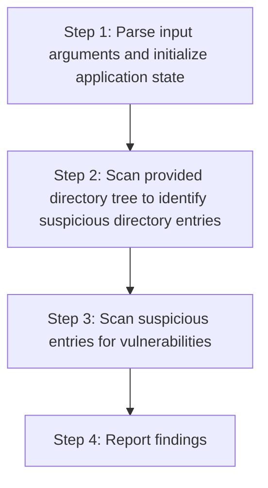
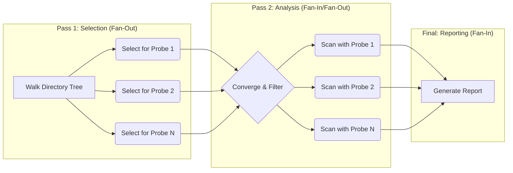

# Shai-Hulud-rs Architecture

This document outlines the high-level architecture of the `shai-hulud-rs` security scanner.
To achieve better performance, this is a re-write of the original script in Rust with some architectural changes that allow to realize parallel processing at every opportunity and implement computationally expensive parts closer to metal.

## 1. High-Level Workflow

On the highest level, the security scanner executes a pretty linear workflow, as illustrated below.



Core components of the scanner are `Scanner`, which orchestrates the scanning using two-pass scanning, delegating actual vulnerability scanning to individual `Probe`s, and `Reporter` that is tasked with converting `Finding`s uncovered by `Probe`s to a human- or machine readable scan reports.

### 1.1. Delegation to Probes

The core `Scanner` is a general-purpose engine that is not aware of any specific vulnerability details.
Instead, it delegates this responsibility to a collection of specialized `Probe` components.

Each `Probe` is a self-contained, stateful module responsible for a single, specific security check (e.g., checking file hashes, analyzing workflow files, etc.).
This allows the scanner to be easily extended by implementing new `Probe`s as needed.

If this approach pans out, this could in future become basis for a more general purpose security scanner.

### 1.2. Fan-Out / Fan-In Parallelization

The scanner utilizes a two-pass, fan-out/fan-in model to parallelize work and make scan go 🚀🚀🚀 

> 🚀🚀🚀 We can't really claim being _"Blazingly Fast"_ here lest we set unreasonably high expectations.
> But the hope is that this scanner will be able to perform same checks significantly faster than the original implementation ever could.




- **Fan-Out (Selection):** The process begins with a single, highly parallel directory walk.
This single event is fanned out to all registered probes, which concurrently "select" files they deem suspicious based on lightweight heuristics.
- **Fan-In (Analysis):** Once the selection pass is complete, the scanner waits for all probes that found suspects to finish their intensive analysis.
The findings from these parallel tasks are then fanned back in and collected into a single, result set, which is grouped by the probe that produced the findings.

This ensures that expensive operations are only performed on a small, pre-qualified subset of files and that the work is distributed across all available CPU cores as efficiently as possible.

### 1.3. Pluggable Reporting

The scanner's core logic is decoupled from the presentation of its findings.
After the analysis is completed, the findings of a security scan are passed to a `Reporter`.

The specific `Reporter` used is determined by command-line arguments (e.g., `ConsoleReporter` for stdout, `JsonReporter` for a JSON file).
Unless otherwise directed by command line arguments, the default reporter is `ConsoleReporter`, that reports all of the findings to user terminal.

This allows the output format to be changed or extended without modifying core scanning engine or any of the probes.

## 2. The Scanner

Scanner has three primary responsibilities:

1.  **Orchestrate the Two-Pass Scan:** It manages the entire two-pass process, ensuring the lightweight selection pass is completed before the intensive analysis pass begins.
2.  **Manage Parallelism:** It is the single source of truth for concurrency.
    It creates and manages the 
ayon thread pool based on the user's command-line arguments, and it is responsible for spawning all asynchronous tasks for the analysis pass.
3.  **Collect and Group Findings:** It provides the mechanism for collecting Findings from all the concurrent probe tasks and groups them by the probe that discovered them before handing them off to the reporting system.

### 2.1. Interaction with Probes

The Scanner is generic and interacts with all probes only through the Probe trait.
During Pass 1, it calls the select() method on each probe.
After Pass 1, it consumes each probe by treating it as an Iterator to take ownership of its collected suspects.
It then uses the probe's scan() method to create the individual analysis tasks for Pass 2.
This design ensures the Scanner remains completely decoupled from the implementation details of any specific probe.

## 3. Probes

Probes are the specialized heart of the scanner, where the actual vulnerability detection logic resides.
They are designed as self-contained components that plug into the main Scanner engine.

### 3.1. The Probe Trait and Associated Types

All probes must implement the Probe trait.
This trait uses an associated type, Suspect, to define what kind of item the probe is looking for.
This is analogous to the Item associated type in Rust's Iterator trait.

```rust
pub trait Probe: Send + Sync {
    /// The type of item this probe selects as a suspect for scanning.
    type Suspect: Suspect;

    /// The error type this probe can return from scanning.
    type Error: Send + Sync + 'static;

    /// Returns the human-readable name of the probe.
    fn name(&self) -> String;

    /// Mark the directory entry to be scanned.
    ///
    /// This method should be designed to be as efficient as possible, avoiding unnecessary computation if possible.
    /// Be as paranoid as possible, marking all files that might need to be scanned during the second pass.
    ///
    /// Return true if the entry was selected to be scanned by the probe, false otherwise.
    fn select(&mut self, entry: &DirEntry) -> bool;

    /// Performs the intensive scan on a single suspect item and returns any number of findings that are discovered.
    fn scan(&self, suspect: &Self::Suspect) -> Result<Vec<Finding>, Self::Error>;

    /// Returns a slice of the suspects collected by the probe during the selection pass.
    fn suspects(&self) -> &[Self::Suspect];
}
```
While most probes will use PathBuf as their Suspect type, this generic design allows future probes to define more complex suspect structures (e.g., a struct containing multiple related file paths) without any changes to the Scanner.

### 3.2. State Management


Each Probe instance is designed to be stateful during the selection pass.

It is responsible for maintaining its own internal list of selected Suspects.

It exposes the list of selected suspects via public `suspects` method.

### 3.3. The scan Method

The core logic of a probe resides in its scan method.
This method is simple, synchronous, and focuses on a single task: analyzing one Suspect and returning any Findings.
All the complexity of asynchronous execution and task scheduling is handled by the Scanner, freeing the probe implementer to focus purely on the detection logic.

### 3.4. Findings and Payloads

When a probe's scan method discovers a vulnerability, it reports it as a `Finding`.

A `Finding` struct contains essential information like the file path, a descriptive message, and a severity level.
Crucially, a `Finding` will also contain an optional `Payload` that adds rich contextual data about the particular finding.

This allows the final Reporter to present detailed, actionable information to the user without being explicitly aware of each and every individual `Probe` implementation details.

## 4. Error Handling

A probe's scanning logic focuses purely on detection of vulnerabilities.
Unrecoverable failures to complete the scan are reported by returning an error result.
Each probe defines its own specific `Error` type via an associated type on the `Probe` trait.

### 4.1. The `TryFrom<Error>` Conversion Pattern

Errors returned from Probe::scan method can be transient (i.e. they may affect only _some_ of the scanned resources) or fatal (as in making it unfeasible for a probe to continue scanning).

When scanner encounters an error response from the probe, it attempts to convert the error into a `Finding` using the `TryFrom<Error>` conversion pattern.

If the error can be converted into a `Finding`, it is added to the list of findings.
Otherwise, the entire scan for this probe should be aborted.

## 5. Reporters

Reporters implement various vulnerability reporting strategies.

They are responsible for formatting and presenting findings in a way that is understandable and actionable for the user.

There are several built-in reporters available:
- `ConsoleReporter`[^1]: Prints findings to the console in a human-readable format.
- `JsonReporter`[^2]: Formats findings as JSON for machine consumption or custom post processing.
- `CsvReporter`[^2]: Generates a CSV report with detailed findings.
- `HtmlReporter`[^2]: Generates an HTML report with detailed findings.

[^1]: There is a very basic implementation of the `ConsoleReporter` that prints out bare minimum information about each finding.
[^2]: At the moment of this writing, JSON, CSV and HTML reporters are not implemented.
